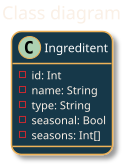

This application is designed to help you plan your weekly menus effortlessly. With just one step, you can access seasonal vegetables and easily organize your meals for the week.


# Development

## Setup

Need to have a Mysql server running, an existent database and .env file as :

DB name: menumaker_dev

```
DB_USER=user
DB_PASSWORD=password
```

## Launch

```bash
mvn spring-boot:run
```

## Use

Get ingredients:

```
http://localhost:8080/ingredients/all
```

Add ingredient:

## Doc

http://localhost:8080/swagger-ui/index.html

Exemple of request:
body:x-www-form-urlencoded:
```
name myIngredientName
type vegetable
seasonal true/false
seasons 7,3
```

https://menumaker.readthedocs.io/fr/latest/setup.html

## Class diagram

```plantuml
@startuml
skinparam backgroundColor #123749
skinparam roundcorner 20
skinparam classfontcolor lemon chiffon
skinparam titlefontcolor linen
skinparam arrowfontcolor linen
skinparam attributefontcolor linen

skinparam class {
BackgroundColor #123749
ArrowColor #EEB258
BorderColor #EEB258
AttributeFontColor linen
}
' skinparam handwritten true
title Class diagram

class Ingreditent {
  - id: Int
  - name: String
  - type: String
  - seasonal: Bool
  - seasons: Int[]
}

@enduml
```

<!-- 

-->

